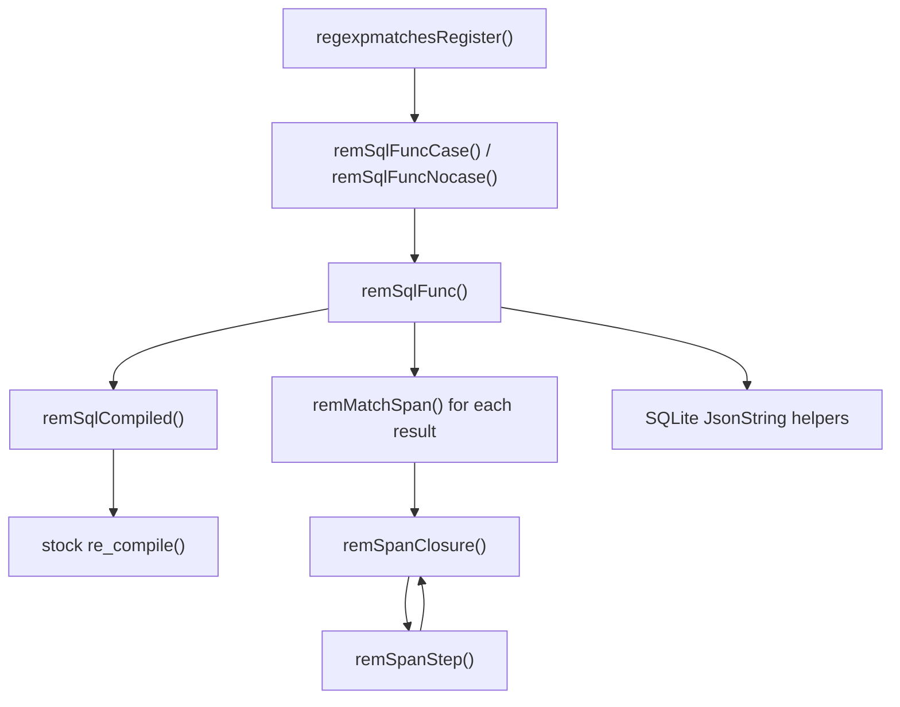

# SQLite `regexpmatches`

`regexpmatches.c` is an amalgamation-only companion to SQLite's stock [`ext/misc/regexp.c`](https://github.com/sqlite/sqlite/blob/master/ext/misc/regexp.c). It adds `regexp_matches()` and `regexpi_matches()`, which return successive non-overlapping complete matches as a JSON array. The module leaves
`regexp.c` unchanged and reuses SQLite's private regexp compiler, NFA representation, UTF-8 routines, limits, allocators, auxiliary-data cache mechanism, and JSON builder. It is intentionally not a separately compiled or loadable extension.

## SQL interface

```sql
regexp_matches(pattern, input)
regexpi_matches(pattern, input)
```

Both functions return JSON text with SQLite's JSON subtype. `regexpi_matches()` follows stock `regexpi()` and performs ASCII-only case-insensitive matching.

```sql
SELECT regexp_matches('[0-9]+', 'A12 B345');
-- ["12","345"]

SELECT regexpi_matches('ab+', 'ABb ab');
-- ["ABb","ab"]

SELECT regexp_matches('xyz', 'abc');
-- []

SELECT regexp_matches('x', NULL);
-- NULL
```

The pattern is the first argument, matching the direct-call convention of SQLite's existing `regexp(pattern, input)` and `regexpi(pattern, input)` functions.

## Match semantics

Matches are selected using:

- leftmost-first search;
- ordered alternation;
- greedy, non-possessive quantifiers;
- successive non-overlapping global iteration;
- no recursive backtracking or combinatorial path enumeration.

Ordered alternatives are significant:

```sql
SELECT regexp_matches('a|aa', 'aa');
-- ["a","a"]

SELECT regexp_matches('aa|a', 'aa');
-- ["aa"]
```

Greedy repetition still permits the remaining pattern to match:

```sql
SELECT regexp_matches('a+', 'aaa');
-- ["aaa"]

SELECT regexp_matches('.*a', 'a 1 a 2');
-- ["a 1 a"]
```

This behavior is implemented by a prioritized Thompson/Pike VM over the NFA compiled by stock `regexp.c`. Earlier alternatives outrank later alternatives; continuing a greedy quantifier outranks exiting it; and a lower-priority acceptance remains available while a higher-priority path is still viable.

Zero-length matches are returned. After one is selected, iteration advances by one complete UTF-8 code point so matching cannot loop indefinitely. An empty match at the exact end of the preceding non-empty match is suppressed.

Parentheses retain the stock engine's non-capturing behavior. Returned array members are complete matched substrings, not capture groups.

## Integration

`regexpmatches.c` depends deliberately on private static definitions from SQLite's regexp and JSON implementations. All components must therefore be part of one C translation unit in this order:

```text
SQLite amalgamation, including JSON
stock ext/misc/regexp.c
src/regexpmatches.c
```

On Windows, a custom build can be obtained using the [sqlite_MSVC_Cpp_Build_Tools.ext.bat](sqlite_MSVC_Cpp_Build_Tools.ext.bat) script (see this [note](https://github.com/pchemguy/Field-Notes/tree/main/11-sqlite-msvc-build) for details).

The match-array initializer is translation-unit private and registers only `regexp_matches()` and `regexpi_matches()`. The stock initializer continues to own `regexp()`, `regexpi()`, and the `REGEXP` operator.

## Code walkthrough

### Module workflow



At connection initialization, `regexpmatchesRegister()` registers the two SQL functions. A SQL call enters the appropriate case-mode wrapper and then the shared `remSqlFunc()` driver. The driver obtains a cached stock NFA, repeatedly asks `remMatchSpan()` for the next span, appends each source slice through SQLite's JSON builder, and advances the global cursor without allowing overlap.

`remMatchSpan()` runs one prioritized Pike-VM search. At each input boundary, `remSpanClosure()` expands non-consuming transitions in priority order and `remSpanStep()` advances viable consuming threads by one decoded character. The cycle continues until the winning acceptance is known or no match remains.

### Function map

| Function                  | Responsibility                                                                                                                                                                                 |
| ------------------------- | ---------------------------------------------------------------------------------------------------------------------------------------------------------------------------------------------- |
| `regexpmatchesRegister()` | Registers `regexp_matches()` and `regexpi_matches()` with deterministic, innocuous, and result-subtype flags. It is private to the amalgamation.                                               |
| `remSqlFuncCase()`        | Thin case-sensitive SQL callback; delegates to `remSqlFunc()` with stock case folding disabled.                                                                                                |
| `remSqlFuncNocase()`      | Thin ASCII case-insensitive SQL callback; delegates with stock case folding enabled.                                                                                                           |
| `remSqlFunc()`            | Owns the complete SQL operation: NULL propagation, cached compilation, global non-overlapping iteration, zero-length progress, JSON construction, subtype assignment, and SQL error reporting. |
| `remSqlCompiled()`        | Retrieves argument 0 from SQLite auxiliary data or compiles it with stock `re_compile()`. It also records whether the compiler inserted the synthetic unanchored-search prefix.                |
| `remCompiledFree()`       | Auxiliary-data destructor for the extraction wrapper and its stock `ReCompiled` object.                                                                                                        |
| `remMatchSpan()`          | Selects one match at or after a byte cursor. It coordinates the Pike VM, candidate starts, accepting fallbacks, anchors, and final start/end offsets.                                          |
| `remSpanVmInit()`         | Allocates the reusable thread lists, closure stack, and visited-state generations for one span search.                                                                                         |
| `remSpanVmClear()`        | Releases all temporary storage owned by a span search.                                                                                                                                         |
| `remSpanNewGeneration()`  | Advances the visited-state generation used for constant-time thread deduplication; resets markers if the counter wraps.                                                                        |
| `remSpanPush()`           | Pushes one thread onto the ordered epsilon-closure stack with a bounds check.                                                                                                                  |
| `remSpanAddSeed()`        | Adds an entry thread only when a higher-priority thread has not already reached the same opcode.                                                                                               |
| `remSpanClosure()`        | Computes the ordered epsilon closure. It applies fork priority, assertions, jumps, optimized `.*`, and acceptance ordering without consuming input.                                            |
| `remSpanConsumes()`       | Tests one consuming stock regexp opcode against the current character and reports the next opcode. It reuses stock word, digit, and whitespace predicates.                                     |
| `remSpanStep()`           | Runs one consuming VM step for the higher-priority ready threads and constructs the next deduplicated thread list.                                                                             |
| `remSpanPrevChar()`       | Decodes the character immediately before a byte boundary for word-boundary assertions.                                                                                                         |
| `remSpanNextChar()`       | Uses the compiled expression's stock decoder to read the character at a byte boundary and return the next boundary.                                                                            |

### Important control points

`remSqlCompiled()` stores extraction-only state in `RemCompiled` rather than changing SQLite's `ReCompiled`. In particular, `bUnanchored` distinguishes the compiler's synthetic leading `RE_OP_ANYSTAR` from a real `.*` at the beginning of an anchored pattern such as `^.*a`.

`remSpanClosure()` is where regex-path priority becomes concrete. For a positive `RE_OP_FORK`, fall-through is visited first, preserving ordered alternation and greedy optional operands. For a negative fork displacement, the repeated path is visited before the exit path. The first thread reaching an opcode in one generation wins; later duplicates cannot have different
future behavior and are discarded.

`remMatchSpan()` does not immediately return on `RE_OP_ACCEPT`. It retains the acceptance as a fallback while any higher-priority thread remains viable. This is what makes the first branch win in `a|aa` while still allowing greedy non-possessive matching in `.*a`.

Finally, `remSqlFunc()` turns single-span selection into global matching. A non-empty result moves the cursor to its end. An empty result advances by one UTF-8 code point, except at end-of-input, and an empty match directly abutting the preceding non-empty result is not emitted.

## Supported pattern language

The module accepts exactly the language compiled by the included stock `regexp.c`, including:

- `*`, `+`, `?`, and `{m,n}` repetition;
- grouping and alternation;
- `^` and `$` anchors;
- `.`, bracket character classes, and negated classes;
- `\b`, `\w`, `\W`, `\d`, `\D`, `\s`, and `\S`;
- the escapes supported by the stock compiler.

It does not add capture extraction, replacement, splitting, overlap mode, flags argument, lazy or possessive quantifiers, lookaround, backreferences, named groups, Unicode case folding, or PCRE syntax.

## Complexity

The span executor is a prioritized Pike VM. At each input boundary, the first thread reaching a compiled program counter wins and duplicate threads are discarded. One span search is bounded by `O(P × I)` time and `O(P)` active-state memory, where `P` is the compiled NFA size and `I` is the examined input length.

Global extraction restarts at the end of each selected match. A higher-priority path may inspect text beyond the fallback match ultimately returned, so the aggregate worst case for `K` results is `O(K × P × I)`. The implementation does not claim whole-call linearity.

## Testing

Tests exercise only the public SQL surface through Python's standard `sqlite3` module under `pytest`. They do not substitute Python regexp or JSON implementations and do not expose test-only C helpers. 

```batch
pytest -vv
```

The suite covers registration, stock-function regressions, ordered alternation, greedy fallback, non-overlap, zero-length progress, anchors, boundaries, UTF-8 slicing, JSON escaping and subtype propagation, errors, connection limits, and adversarial ambiguity.

The current implementation passes 163 SQL-surface tests under normal, AddressSanitizer, and UndefinedBehaviorSanitizer builds. Public-SQL execution covers 92.01% of executable lines and reaches every branch site in `regexp_matches.c`; the remaining lines are defensive allocation-failure and generation-wrap paths that Python's public SQLite API cannot inject
deterministically.

## Repository layout

```text
src/regexpmatches.c                   amalgamation-only production module
regexpmatches/tests/                  structured public-SQL pytest suite
SPECIFICATION.md                      normative implementation specification
sqlite_MSVC_Cpp_Build_Tools.ext.bat   Windows/MSVC build script
```

The detailed semantic, architectural, security, and acceptance requirements are defined in
[SPECIFICATION.md](SPECIFICATION.md).
